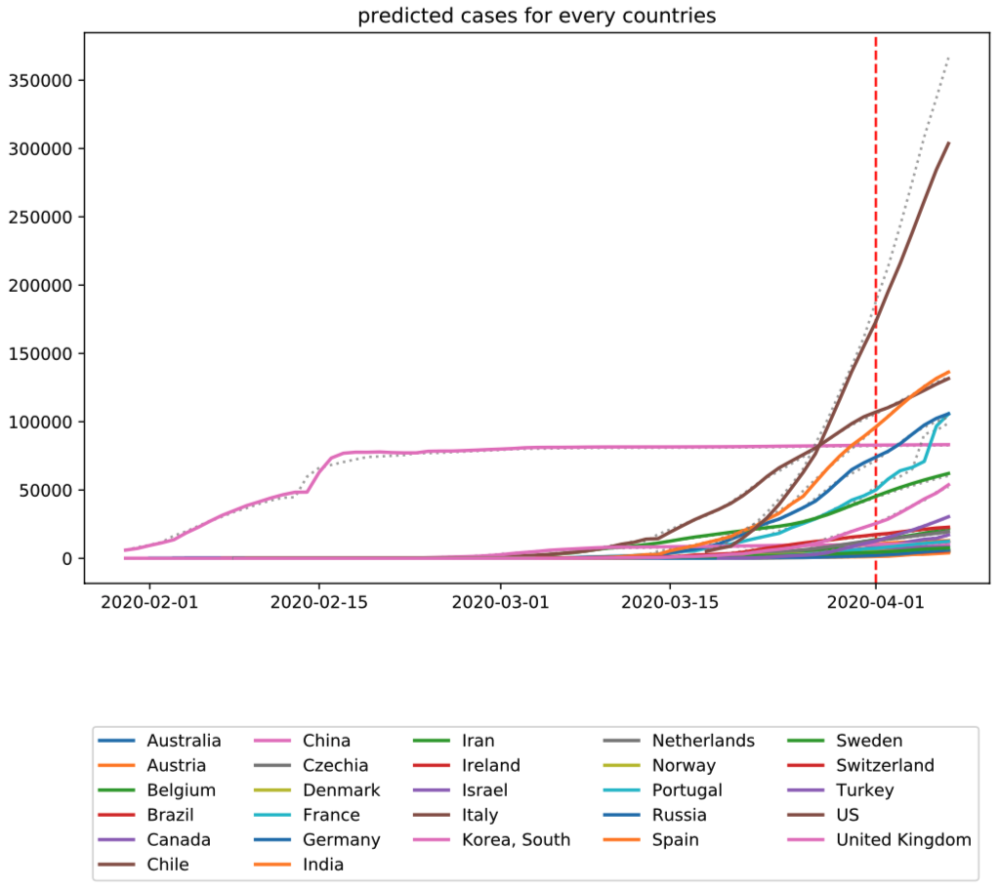

# Covid-19-prediction
This project uses an LSTM to predict confirmed cases of  Covid-19 for different countries. The data comes from kaggle (https://www.kaggle.com/c/covid19-global-forecasting-week-4), which contains the global comfirmed cases from 2/23/2019 to 4/8/2019. 

The figure below shows the results. The dotted grey lines are ground truth data, and the colored lines are predictions. On left side of vertical red line is training data, and on the right unseen testing data. In fact the lines almost covered the grey dots, showing exact prediction.

 

